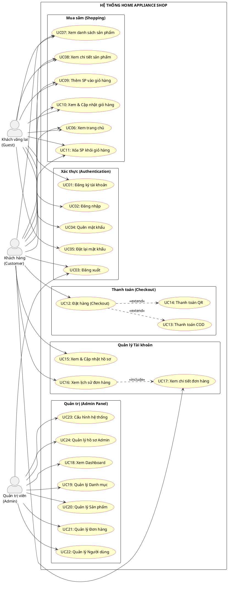
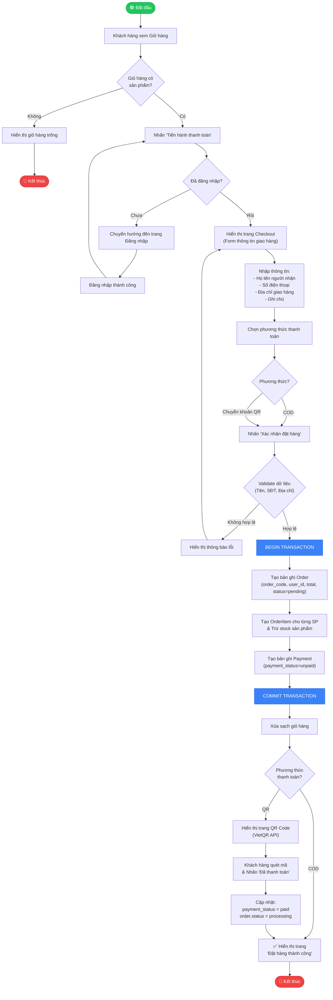
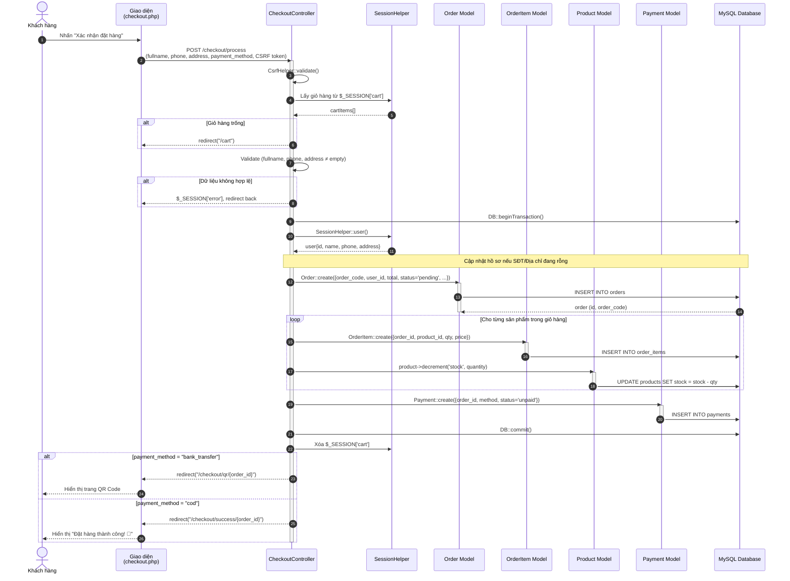
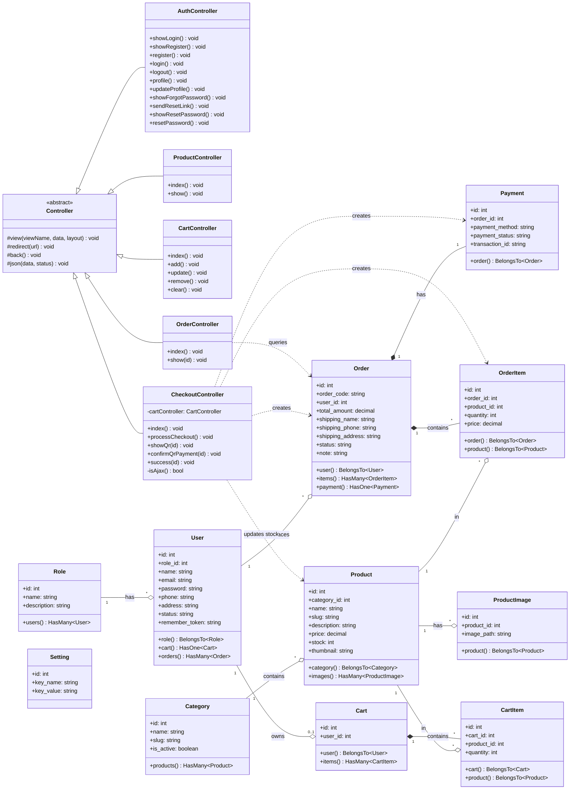

# 📋 TÀI LIỆU PHÂN TÍCH HỆ THỐNG
## Hệ thống Thương mại Điện tử Bán Đồ Gia Dụng — Home Appliance Shop

> **Chuyên viên Phân tích:** System Analyst
> **Ngày lập:** 30/07/2026
> **Phiên bản:** 1.0

---

### THÔNG TIN TỔNG QUAN DỰ ÁN

| Mục | Mô tả |
|---|---|
| **Tên dự án** | Home Appliance Shop — Hệ thống bán đồ gia dụng trực tuyến |
| **Mục tiêu** | Xây dựng nền tảng website cho phép khách hàng duyệt, tìm kiếm, mua sắm đồ gia dụng trực tuyến với hỗ trợ thanh toán COD và chuyển khoản QR. Cung cấp hệ thống quản trị toàn diện cho Admin. |
| **Kiến trúc** | PHP MVC tự xây dựng, sử dụng Eloquent ORM (illuminate/database), PHPMailer |
| **CSDL** | MySQL |
| **Actors** | Khách hàng (Customer), Quản trị viên (Admin) |
| **Danh mục SP** | Thiết bị nhà bếp, Điện gia dụng, Nhà thông minh |

---

## 1. USE CASE DIAGRAM (Sơ đồ Use Case)

### 1.1. Danh sách Actors

| Actor | Mô tả |
|---|---|
| **Khách hàng (Customer)** | Người dùng đã đăng ký tài khoản, có thể duyệt sản phẩm, thêm giỏ hàng, đặt hàng, thanh toán và xem lịch sử mua hàng. |
| **Quản trị viên (Admin)** | Người quản lý hệ thống, có quyền CRUD sản phẩm, danh mục, quản lý đơn hàng, quản lý người dùng, cấu hình website. |
| **Khách vãng lai (Guest)** | Người chưa đăng nhập, chỉ có thể xem trang chủ, duyệt sản phẩm, thêm giỏ hàng (nhưng phải đăng nhập để checkout). |

### 1.2. Danh sách Use Cases

| Nhóm | Use Case | Actor(s) |
|---|---|---|
| **Xác thực** | UC01 – Đăng ký tài khoản | Guest |
| | UC02 – Đăng nhập | Guest |
| | UC03 – Đăng xuất | Customer, Admin |
| | UC04 – Quên mật khẩu (gửi email khôi phục) | Guest |
| | UC05 – Đặt lại mật khẩu | Guest |
| **Mua sắm** | UC06 – Xem trang chủ | Guest, Customer |
| | UC07 – Xem danh sách sản phẩm | Guest, Customer |
| | UC08 – Xem chi tiết sản phẩm | Guest, Customer |
| | UC09 – Thêm sản phẩm vào giỏ hàng | Guest, Customer |
| | UC10 – Xem & Cập nhật giỏ hàng | Guest, Customer |
| | UC11 – Xóa sản phẩm khỏi giỏ hàng | Guest, Customer |
| **Thanh toán** | UC12 – Đặt hàng (Checkout) | Customer |
| | UC13 – Thanh toán COD | Customer |
| | UC14 – Thanh toán chuyển khoản QR | Customer |
| **Tài khoản** | UC15 – Xem & Cập nhật hồ sơ cá nhân | Customer |
| | UC16 – Xem lịch sử đơn hàng | Customer |
| | UC17 – Xem chi tiết đơn hàng | Customer |
| **Admin** | UC18 – Xem Dashboard thống kê | Admin |
| | UC19 – Quản lý Danh mục (CRUD) | Admin |
| | UC20 – Quản lý Sản phẩm (CRUD) | Admin |
| | UC21 – Quản lý Đơn hàng (Xem & Cập nhật trạng thái) | Admin |
| | UC22 – Quản lý Người dùng (Phân quyền, Khóa/Mở) | Admin |
| | UC23 – Cấu hình hệ thống (Settings) | Admin |
| | UC24 – Quản lý hồ sơ Admin | Admin |

### 1.3. Mã PlantUML — Use Case Diagram



---

## 2. USE CASE DESCRIPTION (Mô tả chi tiết Use Case)

### 2.1. UC12 — Đặt hàng (Checkout)

| Mục | Nội dung |
|---|---|
| **Tên Use Case** | UC12 – Đặt hàng (Checkout) |
| **Actor** | Khách hàng (Customer) |
| **Mô tả** | Khách hàng xác nhận đặt hàng các sản phẩm đã chọn trong giỏ hàng, nhập thông tin giao hàng, chọn phương thức thanh toán và hoàn tất đơn hàng. |
| **Pre-conditions** | 1. Khách hàng đã đăng nhập thành công. <br> 2. Giỏ hàng có ít nhất 1 sản phẩm (`$_SESSION['cart']['items']` không rỗng). |
| **Post-conditions** | 1. Đơn hàng (Order) được tạo với trạng thái `pending`. <br> 2. Chi tiết đơn hàng (OrderItem) được lưu cho từng sản phẩm. <br> 3. Bản ghi thanh toán (Payment) được tạo tương ứng. <br> 4. Số lượng tồn kho (stock) của sản phẩm bị trừ đi. <br> 5. Giỏ hàng được xóa sạch. |

**Main Flow (Luồng chính):**

| Bước | Actor / Hệ thống | Hành động |
|:---:|---|---|
| 1 | Khách hàng | Từ trang Giỏ hàng, nhấn nút **"Tiến hành thanh toán"**. |
| 2 | Hệ thống | Kiểm tra middleware `auth` → Xác nhận user đã đăng nhập. Hiển thị trang Checkout với danh sách sản phẩm, tổng tiền. Tự động điền sẵn thông tin (Tên, SĐT, Địa chỉ) từ hồ sơ nếu có. |
| 3 | Khách hàng | Nhập/chỉnh sửa thông tin giao hàng: Họ tên người nhận, Số điện thoại, Địa chỉ giao hàng, Ghi chú (tùy chọn). |
| 4 | Khách hàng | Chọn phương thức thanh toán: **COD** (Thanh toán khi nhận hàng) hoặc **Chuyển khoản ngân hàng (QR)**. |
| 5 | Khách hàng | Nhấn nút **"Xác nhận đặt hàng"**. |
| 6 | Hệ thống | Validate CSRF token. Validate dữ liệu đầu vào (fullname, phone, address không được rỗng). |
| 7 | Hệ thống | Bắt đầu Database Transaction (`DB::beginTransaction`). |
| 8 | Hệ thống | Cập nhật SĐT và Địa chỉ vào hồ sơ người dùng nếu hồ sơ hiện tại đang rỗng (không ghi đè). |
| 9 | Hệ thống | Tạo bản ghi `Order` mới với `order_code = 'HD' + timestamp + random`, `status = 'pending'`. |
| 10 | Hệ thống | Lặp từng sản phẩm trong giỏ hàng: Tạo `OrderItem`, Trừ `stock` sản phẩm (`product->decrement('stock', quantity)`). |
| 11 | Hệ thống | Tạo bản ghi `Payment` với `payment_status = 'unpaid'`. |
| 12 | Hệ thống | Commit Transaction (`DB::commit`). Xóa giỏ hàng. |
| 13 | Hệ thống | Nếu thanh toán COD → Redirect đến trang **Đặt hàng thành công**. Nếu QR → Redirect đến trang **Hiển thị mã QR**. |

**Alternative Flow (Luồng rẽ nhánh):**

| Mã | Điều kiện | Hành động |
|---|---|---|
| **AF-1** | Giỏ hàng trống | Hệ thống redirect về `/cart`. |
| **AF-2** | Chưa đăng nhập | Middleware `auth` redirect về `/login`. |
| **AF-3** | Dữ liệu nhập thiếu (tên/sđt/địa chỉ rỗng) | Hệ thống gán `$_SESSION['error']`, redirect lại trang checkout. |
| **AF-4** | Xảy ra lỗi Exception trong quá trình xử lý | `DB::rollback()` hoàn tác tất cả, ghi log lỗi, redirect quay lại trang trước. |
| **AF-5** | Chọn thanh toán QR | Hệ thống redirect sang `/checkout/qr/{id}` hiển thị QR VietQR. Khách quét mã → nhấn "Đã thanh toán" → Hệ thống cập nhật `payment_status = 'paid'`, `order.status = 'processing'` → Redirect đến trang thành công. |

---

### 2.2. UC02 — Đăng nhập

| Mục | Nội dung |
|---|---|
| **Tên Use Case** | UC02 – Đăng nhập |
| **Actor** | Khách vãng lai (Guest) |
| **Mô tả** | Người dùng nhập email và mật khẩu để xác thực danh tính và truy cập hệ thống. |
| **Pre-conditions** | 1. Người dùng đã có tài khoản trong hệ thống. <br> 2. Người dùng chưa đăng nhập (chưa có session). |
| **Post-conditions** | 1. Session người dùng được thiết lập (lưu `user_id`, thông tin user). <br> 2. Nếu là Admin → Redirect về `/admin/dashboard`. <br> 3. Nếu là Customer → Redirect về `/` (trang chủ). |

**Main Flow:**

| Bước | Actor / Hệ thống | Hành động |
|:---:|---|---|
| 1 | Guest | Truy cập trang `/login`. |
| 2 | Hệ thống | Kiểm tra nếu đã đăng nhập → redirect `/`. Nếu chưa → Hiển thị form đăng nhập (Email, Mật khẩu). |
| 3 | Guest | Nhập Email và Mật khẩu, nhấn **"Đăng nhập"**. |
| 4 | Hệ thống | Validate dữ liệu: kiểm tra email và password không rỗng. |
| 5 | Hệ thống | Tìm User theo email trong CSDL (`User::where('email', ...)->first()`). |
| 6 | Hệ thống | So khớp mật khẩu nhập vào với mật khẩu đã hash bằng `password_verify()`. |
| 7 | Hệ thống | Gọi `SessionHelper::login($user)` để thiết lập session. |
| 8 | Hệ thống | Kiểm tra role: Nếu `role.name === 'admin'` → redirect `/admin/dashboard`. Ngược lại → redirect `/`. |

**Alternative Flow:**

| Mã | Điều kiện | Hành động |
|---|---|---|
| **AF-1** | Email hoặc mật khẩu bỏ trống | Gán `$_SESSION['auth_error']`, redirect lại `/login`. |
| **AF-2** | Email không tồn tại trong CSDL | Gán thông báo "Email hoặc mật khẩu không chính xác", redirect `/login`. |
| **AF-3** | Mật khẩu không khớp | Tương tự AF-2 (không tiết lộ cụ thể lỗi nào). |

---

### 2.3. UC21 — Quản lý Đơn hàng (Admin)

| Mục | Nội dung |
|---|---|
| **Tên Use Case** | UC21 – Quản lý Đơn hàng |
| **Actor** | Quản trị viên (Admin) |
| **Mô tả** | Admin xem danh sách tất cả đơn hàng, xem chi tiết từng đơn và cập nhật trạng thái đơn hàng. |
| **Pre-conditions** | Admin đã đăng nhập và được xác thực qua middleware `admin`. |
| **Post-conditions** | Trạng thái đơn hàng được cập nhật trong CSDL. |

**Main Flow:**

| Bước | Actor / Hệ thống | Hành động |
|:---:|---|---|
| 1 | Admin | Truy cập menu **"Quản lý Đơn hàng"** (`/admin/orders`). |
| 2 | Hệ thống | Truy vấn tất cả Order kèm thông tin User, hiển thị danh sách (Mã đơn, Tên KH, Tổng tiền, Trạng thái, Ngày tạo). |
| 3 | Admin | Nhấn **"Xem chi tiết"** của 1 đơn hàng (`/admin/orders/show/{id}`). |
| 4 | Hệ thống | Truy vấn Order kèm `items.product` và `payment`, hiển thị đầy đủ thông tin giao hàng, danh sách sản phẩm, trạng thái thanh toán. |
| 5 | Admin | Chọn trạng thái mới từ dropdown (`pending` → `processing` → `shipped` → `completed` / `cancelled`), nhấn **"Cập nhật"**. |
| 6 | Hệ thống | Gọi `POST /admin/orders/update-status/{id}`, cập nhật `order.status` trong CSDL, thông báo thành công. |

**Alternative Flow:**

| Mã | Điều kiện | Hành động |
|---|---|---|
| **AF-1** | Đơn hàng không tồn tại | Redirect về danh sách đơn hàng. |
| **AF-2** | Trạng thái không hợp lệ | Từ chối cập nhật, thông báo lỗi. |

---

## 3. ACTIVITY DIAGRAM (Sơ đồ Hoạt động)

### Quy trình: Khách hàng Đặt hàng & Thanh toán



---

## 4. SEQUENCE DIAGRAM (Sơ đồ Tuần tự)

### Luồng chính: Khách hàng đặt hàng (processCheckout)



---

## 5. CLASS DIAGRAM (Sơ đồ Lớp)



---

## 6. ERD — Entity Relationship Diagram

```mermaid
erDiagram
    ROLES ||--o{ USERS : "1 Role có nhiều Users"
    USERS ||--o| CARTS : "1 User sở hữu 1 Cart"
    USERS ||--o{ ORDERS : "1 User đặt nhiều Orders"
    CATEGORIES ||--o{ PRODUCTS : "1 Category chứa nhiều Products"
    PRODUCTS ||--o{ PRODUCT_IMAGES : "1 Product có nhiều ảnh phụ"
    PRODUCTS ||--o{ CART_ITEMS : "1 Product nằm trong nhiều CartItems"
    PRODUCTS ||--o{ ORDER_ITEMS : "1 Product thuộc nhiều OrderItems"
    CARTS ||--o{ CART_ITEMS : "1 Cart chứa nhiều CartItems"
    ORDERS ||--o{ ORDER_ITEMS : "1 Order gồm nhiều OrderItems"
    ORDERS ||--|| PAYMENTS : "1 Order có 1 Payment"

    ROLES {
        int id PK "AUTO_INCREMENT"
        varchar name UK "Tên vai trò (admin/customer)"
        varchar description "Mô tả"
        timestamp created_at
        timestamp updated_at
    }

    USERS {
        int id PK "AUTO_INCREMENT"
        int role_id FK "→ roles.id"
        varchar name "Họ tên"
        varchar email UK "Email đăng nhập"
        varchar password "Mật khẩu (bcrypt)"
        varchar phone "Số điện thoại"
        text address "Địa chỉ"
        varchar status "Trạng thái (active/blocked)"
        varchar remember_token "Token ghi nhớ"
        timestamp created_at
        timestamp updated_at
    }

    CATEGORIES {
        int id PK "AUTO_INCREMENT"
        varchar name "Tên danh mục"
        varchar slug UK "URL-friendly slug"
        boolean is_active "Trạng thái kích hoạt"
        timestamp created_at
        timestamp updated_at
    }

    PRODUCTS {
        int id PK "AUTO_INCREMENT"
        int category_id FK "→ categories.id"
        varchar name "Tên sản phẩm"
        varchar slug UK "URL-friendly slug"
        text description "Mô tả sản phẩm"
        decimal price "Giá bán (15,2)"
        int stock "Số lượng tồn kho"
        varchar thumbnail "Ảnh đại diện"
        timestamp created_at
        timestamp updated_at
    }

    PRODUCT_IMAGES {
        int id PK "AUTO_INCREMENT"
        int product_id FK "→ products.id"
        varchar image_path "Đường dẫn ảnh phụ"
        timestamp created_at
        timestamp updated_at
    }

    CARTS {
        int id PK "AUTO_INCREMENT"
        int user_id FK_UK "→ users.id (UNIQUE)"
        timestamp created_at
        timestamp updated_at
    }

    CART_ITEMS {
        int id PK "AUTO_INCREMENT"
        int cart_id FK "→ carts.id"
        int product_id FK "→ products.id"
        int quantity "Số lượng"
        timestamp created_at
        timestamp updated_at
    }

    ORDERS {
        int id PK "AUTO_INCREMENT"
        varchar order_code UK "Mã đơn hàng (HD...)"
        int user_id FK "→ users.id"
        decimal total_amount "Tổng tiền (15,2)"
        varchar shipping_name "Tên người nhận"
        varchar shipping_phone "SĐT người nhận"
        text shipping_address "Địa chỉ giao hàng"
        varchar status "pending/processing/shipped/completed/cancelled"
        text note "Ghi chú"
        timestamp created_at
        timestamp updated_at
    }

    ORDER_ITEMS {
        int id PK "AUTO_INCREMENT"
        int order_id FK "→ orders.id"
        int product_id FK "→ products.id"
        int quantity "Số lượng mua"
        decimal price "Giá đóng băng tại thời điểm mua (15,2)"
    }

    PAYMENTS {
        int id PK "AUTO_INCREMENT"
        int order_id FK_UK "→ orders.id (UNIQUE)"
        varchar payment_method "cod / bank_transfer"
        varchar payment_status "unpaid / paid / failed / refunded"
        varchar transaction_id "Mã giao dịch"
        timestamp created_at
        timestamp updated_at
    }

    PASSWORD_RESETS {
        varchar email PK "Email người dùng"
        varchar token "Token khôi phục (hashed)"
        timestamp created_at
    }

    SETTINGS {
        int id PK "AUTO_INCREMENT"
        varchar key_name UK "Tên cấu hình"
        text key_value "Giá trị cấu hình"
        timestamp created_at
        timestamp updated_at
    }
```

---

## 7. DATABASE SCHEMA & SCRIPT SQL (DDL)

### 7.1. Thiết kế chi tiết các bảng

| # | Bảng | Mô tả | PK | FK |
|:---:|---|---|---|---|
| 1 | `roles` | Vai trò người dùng | `id` | — |
| 2 | `users` | Tài khoản người dùng | `id` | `role_id → roles.id` |
| 3 | `password_resets` | Token đặt lại mật khẩu | `email` | — |
| 4 | `categories` | Danh mục sản phẩm | `id` | — |
| 5 | `products` | Sản phẩm | `id` | `category_id → categories.id` |
| 6 | `product_images` | Ảnh phụ sản phẩm | `id` | `product_id → products.id` |
| 7 | `carts` | Giỏ hàng | `id` | `user_id → users.id` |
| 8 | `cart_items` | Chi tiết giỏ hàng | `id` | `cart_id → carts.id`, `product_id → products.id` |
| 9 | `orders` | Đơn đặt hàng | `id` | `user_id → users.id` |
| 10 | `order_items` | Chi tiết đơn hàng | `id` | `order_id → orders.id`, `product_id → products.id` |
| 11 | `payments` | Thông tin thanh toán | `id` | `order_id → orders.id` |
| 12 | `settings` | Cấu hình hệ thống | `id` | — |

### 7.2. Script SQL DDL (CREATE TABLE)

```sql
-- ============================================================
-- HOME APPLIANCE SHOP - Database Schema
-- CSDL: MySQL 8.x | Engine: InnoDB | Charset: utf8mb4
-- ============================================================

SET FOREIGN_KEY_CHECKS = 0;

-- -----------------------------------------------------------
-- 1. BẢNG ROLES (Vai trò người dùng)
-- -----------------------------------------------------------
DROP TABLE IF EXISTS `roles`;
CREATE TABLE `roles` (
    `id`          INT UNSIGNED AUTO_INCREMENT PRIMARY KEY,
    `name`        VARCHAR(50)  NOT NULL UNIQUE COMMENT 'Tên vai trò: admin, customer',
    `description` VARCHAR(255) NULL COMMENT 'Mô tả vai trò',
    `created_at`  TIMESTAMP DEFAULT CURRENT_TIMESTAMP,
    `updated_at`  TIMESTAMP DEFAULT CURRENT_TIMESTAMP ON UPDATE CURRENT_TIMESTAMP
) ENGINE=InnoDB DEFAULT CHARSET=utf8mb4 COLLATE=utf8mb4_unicode_ci;

-- -----------------------------------------------------------
-- 2. BẢNG USERS (Người dùng)
-- -----------------------------------------------------------
DROP TABLE IF EXISTS `users`;
CREATE TABLE `users` (
    `id`             INT UNSIGNED AUTO_INCREMENT PRIMARY KEY,
    `role_id`        INT UNSIGNED NOT NULL COMMENT 'FK → roles.id',
    `name`           VARCHAR(100) NOT NULL COMMENT 'Họ và tên',
    `email`          VARCHAR(100) NOT NULL UNIQUE COMMENT 'Email đăng nhập',
    `password`       VARCHAR(255) NOT NULL COMMENT 'Mật khẩu (bcrypt hash)',
    `phone`          VARCHAR(20)  NULL COMMENT 'Số điện thoại',
    `address`        TEXT         NULL COMMENT 'Địa chỉ mặc định',
    `status`         VARCHAR(20)  DEFAULT 'active' COMMENT 'Trạng thái: active / blocked',
    `remember_token` VARCHAR(100) NULL COMMENT 'Token ghi nhớ đăng nhập',
    `created_at`     TIMESTAMP DEFAULT CURRENT_TIMESTAMP,
    `updated_at`     TIMESTAMP DEFAULT CURRENT_TIMESTAMP ON UPDATE CURRENT_TIMESTAMP,

    CONSTRAINT `fk_users_role` FOREIGN KEY (`role_id`)
        REFERENCES `roles`(`id`) ON DELETE CASCADE ON UPDATE CASCADE
) ENGINE=InnoDB DEFAULT CHARSET=utf8mb4 COLLATE=utf8mb4_unicode_ci;

-- -----------------------------------------------------------
-- 3. BẢNG PASSWORD_RESETS (Khôi phục mật khẩu)
-- -----------------------------------------------------------
DROP TABLE IF EXISTS `password_resets`;
CREATE TABLE `password_resets` (
    `email`      VARCHAR(100) NOT NULL PRIMARY KEY COMMENT 'Email người dùng',
    `token`      VARCHAR(255) NOT NULL COMMENT 'Token đã hash',
    `created_at` TIMESTAMP DEFAULT CURRENT_TIMESTAMP
) ENGINE=InnoDB DEFAULT CHARSET=utf8mb4 COLLATE=utf8mb4_unicode_ci;

-- -----------------------------------------------------------
-- 4. BẢNG CATEGORIES (Danh mục sản phẩm)
-- -----------------------------------------------------------
DROP TABLE IF EXISTS `categories`;
CREATE TABLE `categories` (
    `id`         INT UNSIGNED AUTO_INCREMENT PRIMARY KEY,
    `name`       VARCHAR(100) NOT NULL COMMENT 'Tên danh mục',
    `slug`       VARCHAR(100) NOT NULL UNIQUE COMMENT 'URL slug',
    `is_active`  TINYINT(1) DEFAULT 1 COMMENT 'Kích hoạt: 1=Có, 0=Không',
    `created_at` TIMESTAMP DEFAULT CURRENT_TIMESTAMP,
    `updated_at` TIMESTAMP DEFAULT CURRENT_TIMESTAMP ON UPDATE CURRENT_TIMESTAMP
) ENGINE=InnoDB DEFAULT CHARSET=utf8mb4 COLLATE=utf8mb4_unicode_ci;

-- -----------------------------------------------------------
-- 5. BẢNG PRODUCTS (Sản phẩm)
-- -----------------------------------------------------------
DROP TABLE IF EXISTS `products`;
CREATE TABLE `products` (
    `id`          INT UNSIGNED AUTO_INCREMENT PRIMARY KEY,
    `category_id` INT UNSIGNED NOT NULL COMMENT 'FK → categories.id',
    `name`        VARCHAR(255) NOT NULL COMMENT 'Tên sản phẩm',
    `slug`        VARCHAR(255) NOT NULL UNIQUE COMMENT 'URL slug',
    `description` TEXT         NULL COMMENT 'Mô tả sản phẩm',
    `price`       DECIMAL(15,2) NOT NULL DEFAULT 0 COMMENT 'Giá bán (VNĐ)',
    `stock`       INT NOT NULL DEFAULT 0 COMMENT 'Số lượng tồn kho',
    `thumbnail`   VARCHAR(255) NULL COMMENT 'Ảnh đại diện (URL hoặc đường dẫn)',
    `created_at`  TIMESTAMP DEFAULT CURRENT_TIMESTAMP,
    `updated_at`  TIMESTAMP DEFAULT CURRENT_TIMESTAMP ON UPDATE CURRENT_TIMESTAMP,

    CONSTRAINT `fk_products_category` FOREIGN KEY (`category_id`)
        REFERENCES `categories`(`id`) ON DELETE CASCADE ON UPDATE CASCADE
) ENGINE=InnoDB DEFAULT CHARSET=utf8mb4 COLLATE=utf8mb4_unicode_ci;

-- -----------------------------------------------------------
-- 6. BẢNG PRODUCT_IMAGES (Ảnh phụ sản phẩm)
-- -----------------------------------------------------------
DROP TABLE IF EXISTS `product_images`;
CREATE TABLE `product_images` (
    `id`         INT UNSIGNED AUTO_INCREMENT PRIMARY KEY,
    `product_id` INT UNSIGNED NOT NULL COMMENT 'FK → products.id',
    `image_path` VARCHAR(255) NOT NULL COMMENT 'Đường dẫn ảnh',
    `created_at` TIMESTAMP DEFAULT CURRENT_TIMESTAMP,
    `updated_at` TIMESTAMP DEFAULT CURRENT_TIMESTAMP ON UPDATE CURRENT_TIMESTAMP,

    CONSTRAINT `fk_product_images_product` FOREIGN KEY (`product_id`)
        REFERENCES `products`(`id`) ON DELETE CASCADE ON UPDATE CASCADE
) ENGINE=InnoDB DEFAULT CHARSET=utf8mb4 COLLATE=utf8mb4_unicode_ci;

-- -----------------------------------------------------------
-- 7. BẢNG CARTS (Giỏ hàng)
-- -----------------------------------------------------------
DROP TABLE IF EXISTS `carts`;
CREATE TABLE `carts` (
    `id`         INT UNSIGNED AUTO_INCREMENT PRIMARY KEY,
    `user_id`    INT UNSIGNED NOT NULL UNIQUE COMMENT 'FK → users.id (1 user = 1 cart)',
    `created_at` TIMESTAMP DEFAULT CURRENT_TIMESTAMP,
    `updated_at` TIMESTAMP DEFAULT CURRENT_TIMESTAMP ON UPDATE CURRENT_TIMESTAMP,

    CONSTRAINT `fk_carts_user` FOREIGN KEY (`user_id`)
        REFERENCES `users`(`id`) ON DELETE CASCADE ON UPDATE CASCADE
) ENGINE=InnoDB DEFAULT CHARSET=utf8mb4 COLLATE=utf8mb4_unicode_ci;

-- -----------------------------------------------------------
-- 8. BẢNG CART_ITEMS (Chi tiết giỏ hàng)
-- -----------------------------------------------------------
DROP TABLE IF EXISTS `cart_items`;
CREATE TABLE `cart_items` (
    `id`         INT UNSIGNED AUTO_INCREMENT PRIMARY KEY,
    `cart_id`    INT UNSIGNED NOT NULL COMMENT 'FK → carts.id',
    `product_id` INT UNSIGNED NOT NULL COMMENT 'FK → products.id',
    `quantity`   INT NOT NULL DEFAULT 1 COMMENT 'Số lượng',
    `created_at` TIMESTAMP DEFAULT CURRENT_TIMESTAMP,
    `updated_at` TIMESTAMP DEFAULT CURRENT_TIMESTAMP ON UPDATE CURRENT_TIMESTAMP,

    CONSTRAINT `fk_cart_items_cart` FOREIGN KEY (`cart_id`)
        REFERENCES `carts`(`id`) ON DELETE CASCADE ON UPDATE CASCADE,
    CONSTRAINT `fk_cart_items_product` FOREIGN KEY (`product_id`)
        REFERENCES `products`(`id`) ON DELETE CASCADE ON UPDATE CASCADE
) ENGINE=InnoDB DEFAULT CHARSET=utf8mb4 COLLATE=utf8mb4_unicode_ci;

-- -----------------------------------------------------------
-- 9. BẢNG ORDERS (Đơn đặt hàng)
-- -----------------------------------------------------------
DROP TABLE IF EXISTS `orders`;
CREATE TABLE `orders` (
    `id`               INT UNSIGNED AUTO_INCREMENT PRIMARY KEY,
    `order_code`       VARCHAR(50)   NOT NULL UNIQUE COMMENT 'Mã đơn hàng (VD: HD1722345678912)',
    `user_id`          INT UNSIGNED  NOT NULL COMMENT 'FK → users.id',
    `total_amount`     DECIMAL(15,2) NOT NULL COMMENT 'Tổng tiền đơn hàng (VNĐ)',
    `shipping_name`    VARCHAR(100)  NOT NULL COMMENT 'Tên người nhận hàng',
    `shipping_phone`   VARCHAR(20)   NOT NULL COMMENT 'SĐT người nhận',
    `shipping_address` TEXT          NOT NULL COMMENT 'Địa chỉ giao hàng',
    `status`           VARCHAR(20) DEFAULT 'pending'
                       COMMENT 'Trạng thái: pending / processing / shipped / completed / cancelled',
    `note`             TEXT NULL COMMENT 'Ghi chú của khách hàng',
    `created_at`       TIMESTAMP DEFAULT CURRENT_TIMESTAMP,
    `updated_at`       TIMESTAMP DEFAULT CURRENT_TIMESTAMP ON UPDATE CURRENT_TIMESTAMP,

    CONSTRAINT `fk_orders_user` FOREIGN KEY (`user_id`)
        REFERENCES `users`(`id`) ON DELETE CASCADE ON UPDATE CASCADE
) ENGINE=InnoDB DEFAULT CHARSET=utf8mb4 COLLATE=utf8mb4_unicode_ci;

-- -----------------------------------------------------------
-- 10. BẢNG ORDER_ITEMS (Chi tiết đơn hàng)
-- -----------------------------------------------------------
DROP TABLE IF EXISTS `order_items`;
CREATE TABLE `order_items` (
    `id`         INT UNSIGNED AUTO_INCREMENT PRIMARY KEY,
    `order_id`   INT UNSIGNED  NOT NULL COMMENT 'FK → orders.id',
    `product_id` INT UNSIGNED  NOT NULL COMMENT 'FK → products.id',
    `quantity`   INT NOT NULL COMMENT 'Số lượng mua',
    `price`      DECIMAL(15,2) NOT NULL COMMENT 'Giá tại thời điểm mua (đóng băng)',

    CONSTRAINT `fk_order_items_order` FOREIGN KEY (`order_id`)
        REFERENCES `orders`(`id`) ON DELETE CASCADE ON UPDATE CASCADE,
    CONSTRAINT `fk_order_items_product` FOREIGN KEY (`product_id`)
        REFERENCES `products`(`id`) ON DELETE CASCADE ON UPDATE CASCADE
) ENGINE=InnoDB DEFAULT CHARSET=utf8mb4 COLLATE=utf8mb4_unicode_ci;

-- -----------------------------------------------------------
-- 11. BẢNG PAYMENTS (Thông tin thanh toán)
-- -----------------------------------------------------------
DROP TABLE IF EXISTS `payments`;
CREATE TABLE `payments` (
    `id`             INT UNSIGNED AUTO_INCREMENT PRIMARY KEY,
    `order_id`       INT UNSIGNED NOT NULL UNIQUE COMMENT 'FK → orders.id (1 order = 1 payment)',
    `payment_method` VARCHAR(50) NOT NULL DEFAULT 'cod'
                     COMMENT 'Phương thức: cod / bank_transfer',
    `payment_status` VARCHAR(20) DEFAULT 'unpaid'
                     COMMENT 'Trạng thái: unpaid / paid / failed / refunded',
    `transaction_id` VARCHAR(100) NULL COMMENT 'Mã giao dịch từ cổng thanh toán',
    `created_at`     TIMESTAMP DEFAULT CURRENT_TIMESTAMP,
    `updated_at`     TIMESTAMP DEFAULT CURRENT_TIMESTAMP ON UPDATE CURRENT_TIMESTAMP,

    CONSTRAINT `fk_payments_order` FOREIGN KEY (`order_id`)
        REFERENCES `orders`(`id`) ON DELETE CASCADE ON UPDATE CASCADE
) ENGINE=InnoDB DEFAULT CHARSET=utf8mb4 COLLATE=utf8mb4_unicode_ci;

-- -----------------------------------------------------------
-- 12. BẢNG SETTINGS (Cấu hình hệ thống)
-- -----------------------------------------------------------
DROP TABLE IF EXISTS `settings`;
CREATE TABLE `settings` (
    `id`         INT UNSIGNED AUTO_INCREMENT PRIMARY KEY,
    `key_name`   VARCHAR(100) NOT NULL UNIQUE COMMENT 'Tên khóa cấu hình',
    `key_value`  TEXT NULL COMMENT 'Giá trị cấu hình',
    `created_at` TIMESTAMP DEFAULT CURRENT_TIMESTAMP,
    `updated_at` TIMESTAMP DEFAULT CURRENT_TIMESTAMP ON UPDATE CURRENT_TIMESTAMP
) ENGINE=InnoDB DEFAULT CHARSET=utf8mb4 COLLATE=utf8mb4_unicode_ci;

SET FOREIGN_KEY_CHECKS = 1;

-- ============================================================
-- DỮ LIỆU MẪU BAN ĐẦU (SEED DATA)
-- ============================================================

-- Roles
INSERT INTO `roles` (`name`, `description`) VALUES
    ('admin', 'Quản trị viên hệ thống'),
    ('customer', 'Khách hàng mua sắm');

-- Admin user (mật khẩu: 123456)
INSERT INTO `users` (`role_id`, `name`, `email`, `password`, `phone`, `address`) VALUES
    (1, 'Administrator', 'admin@gmail.com',
     '$2y$10$92IXUNpkjO0rOQ5byMi.Ye4oKoEa3Ro9llC/.og/at2.uheWG/igi',
     '0901234567', 'TP. Hồ Chí Minh');

-- Categories
INSERT INTO `categories` (`slug`, `name`, `is_active`) VALUES
    ('thiet-bi-nha-bep', 'Thiết Bị Nhà Bếp', 1),
    ('dien-gia-dung', 'Điện Gia Dụng', 1),
    ('nha-thong-minh', 'Nhà Thông Minh', 1);

-- Settings
INSERT INTO `settings` (`key_name`, `key_value`) VALUES
    ('site_name', 'HomeApp Shop'),
    ('site_hotline', '1900 8888'),
    ('site_email', 'support@homeapp.vn'),
    ('primary_color', '#0d6efd'),
    ('announcement', 'Chào mừng bạn đến với HomeApp Shop!');
```

---

> **Ghi chú sử dụng:**
> - Các sơ đồ **PlantUML** có thể paste vào [plantuml.com/plantuml](https://www.plantuml.com/plantuml/uml) hoặc extension PlantUML trên VS Code.
> - Các sơ đồ **Mermaid** có thể paste vào [mermaid.live](https://mermaid.live), hoặc hiển thị trực tiếp trên GitHub / GitLab / Notion.
> - Script SQL DDL chạy trên **MySQL 8.x** với engine **InnoDB** và charset **utf8mb4**.
